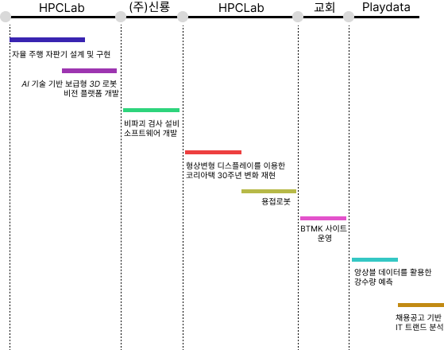

### Follow me 👇
<a href="https://velog.io/@rlaeorjs1001"> <a href="https://www.youtube.com/@daivded"> 

### Hi there 👋
🌱 I'm currently studying Data Engineering 
🤔 but I decide to be a service developer standalone 
😄 so I spend many time to study tech stacks  

## Research & Project

<!--
**Abel3005/Abel3005** is a ✨ _special_ ✨ repository because its `README.md` (this file) appears on your GitHub profile.

Here are some ideas to get you started:

- 🔭 I’m currently working on ...
- 🌱 I’m currently learning ...
- 👯 I’m looking to collaborate on ...
- 🤔 I’m looking for help with ...
- 💬 Ask me about ...
- 📫 How to reach me: ...
- 😄 Pronouns: ...
- ⚡ Fun fact: ...
-->
